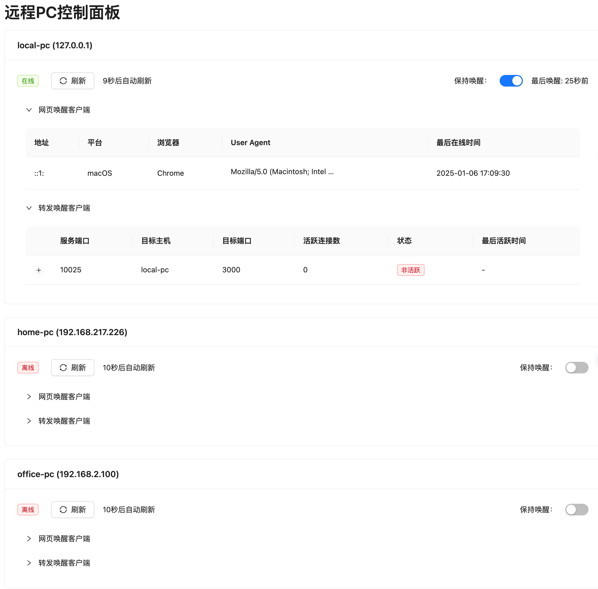
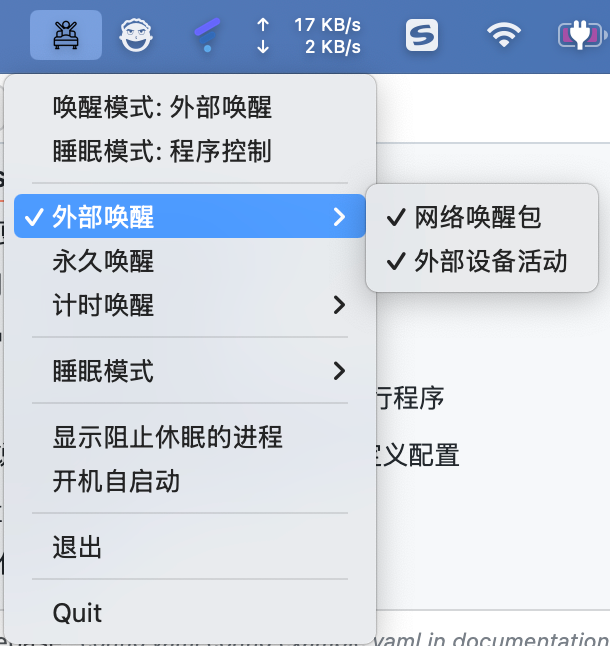

# GreenWake

本项目为远程唤醒的完整方案，包含 Greenwake Bridge 服务端和 Greenwake Guard 客户端

1. Greenwake Bridge： 远程唤醒与端口转发工具，实现持续唤醒和请求唤醒
   1. 打开网页实现持续唤醒
   2. 通过端口转发实现请求时唤醒，类似函数服务，实现请求时唤醒，空闲休眠（需配合 Greenwake Guard 客户端，否则可能出现服务中预期外休眠）
2. Greenwake Guard： 系统休眠控制工具，实现系统休眠控制，支持永久唤醒、定时唤醒、外部事件唤醒





## Greenwake Bridge

一个基于 Web 的远程 PC 唤醒和端口转发管理工具，支持多主机管理、自动唤醒和端口转发， 尤其是转发前唤醒的功能，可以无痛使用休眠主机的服务， 例如通过一条ssh命令就能将远程主机唤醒并连接。

### 功能特点

- 🖥️ 多主机管理：支持管理多台远程主机
- 🔄 自动唤醒：通过 WOL (Wake-on-LAN) 实现远程唤醒
- 🚀 端口转发：支持多端口转发配置，转发时唤醒
- 🔄 自动重试：主机唤醒失败时自动重试
- 📊 实时监控：显示主机状态、客户端连接信息
- 🌐 Web 界面：友好的 Web 管理界面

### 配置文件说明

```yaml
log:
  level: "debug"  # 日志级别：debug, info, warn, error（默认：debug）

http:
  port: "8055"    # Web服务端口（默认：8055）
  user: "admin"   # 管理员用户名
  password: "123456" # 管理员密码
  refresh_interval: 30  # 状态刷新间隔，单位秒（默认：30）

hosts:  # 主机配置
  - name: "home-pc"        # 主机名称
    ip: "192.168.1.100"    # 主机IP
    mac: "XX:XX:XX:XX:XX:XX" # 主机MAC地址
    monitor_port: 3389     # 监控端口
    wake_timeout: 5        # 唤醒超时时间(秒)，默认10秒
    retry_count: 4         # 唤醒重试次数，默认1次
    wake_interval: 5       # 唤醒间隔时间(秒)，默认5秒

forwards:  # 端口转发配置
  - service_port: 13322    # 服务端监听端口
    target_host: "home-pc" # 目标主机名称
    target_port: 22022     # 目标主机端口
```

### 使用指南

#### Docker 方式启动

1. 准备配置文件（可选）

```bash
# 如果需要自定义配置，可以创建配置文件
vim ./config.yaml  # 编辑配置文件
```

2. 运行容器

```bash
docker run -d \
  --name greenwake-bridge \
  --restart unless-stopped \
  -p 8055:8055 \
  -v ./config.yaml:/app/config.yaml \
  xuping/greenwake-bridge:latest
```

如果没有提供配置文件，程序会自动创建一个默认配置。默认配置包括：

- 日志级别：debug
- HTTP 端口：8055
- 状态刷新间隔：30秒
- 唤醒超时时间：10秒
- 唤醒重试次数：1次
- 唤醒间隔时间：5秒

#### 本地编译启动

1. 克隆代码

```bash
git clone https://github.com/fliaping/GreenWake.git
cd greenwake-bridge
```

2. 编译运行

```bash
# 编译前端
cd web
npm install
npm run build

# 编译后端
cd ..
# [MacOs]安装task
brew install go-task/tap/go-task
# [平台通用]安装task
go install github.com/go-task/task/v3/cmd/task@latest

# 安装依赖
task install-deps
#[可选]整理和清理项目依赖关系
go mod tidy 

# 直接运行
go run cmd/server/main.go  # 配置文件会自动创建

# 或者构建&运行
go build -o greenwake-bridge ./cmd/server
./greenwake-bridge  # 配置文件会自动创建
```

### 开发指南

#### 项目结构

```
.
├── cmd/
│   └── server/          # 程序入口
├── internal/
│   ├── api/            # HTTP API 处理
│   ├── config/         # 配置管理
│   ├── model/          # 数据模型
│   └── service/        # 业务逻辑
├── web/                # 前端代码
│   ├── src/
│   └── package.json
└── config.example.yaml # 示例配置文件
```

#### 前端开发

1. 开发环境启动

```bash
cd web
npm install
npm run dev
```

2. 构建

```bash
npm run build
```

主要技术栈：

- React
- TypeScript
- Ant Design
- Vite

#### 后端开发

1. 开发环境启动

```bash
go run ./cmd/server  # 配置文件会自动创建
```

2. 构建

```bash
go build -o greenwake-bridge ./cmd/server
```

主要功能模块：

- `api`: HTTP API 路由和处理
- `service/pc.go`: 主机管理和唤醒
- `service/forward.go`: 端口转发
- `config`: 配置文件处理

主要技术栈：

- Go
- Gin
- Wake-on-LAN
- TCP 端口转发

#### API 接口

- `GET /api/pc/hosts`: 获取主机列表
- `GET /api/pc/:hostName/status`: 获取主机状态
- `GET /api/pc/:hostName/client_info`: 获取客户端信息
- `GET /api/pc/:hostName/forward_channels`: 获取转发通道信息

#### Docker构建

多平台镜像构建

```shell
# 创建构建环境
docker buildx create --name mybuilder --driver docker-container --bootstrap
# 使用新创建的构建环境
docker buildx use mybuilder
# 构建并推送到仓库
docker buildx build --platform linux/amd64,linux/arm64 -t xuping/greenwake-bridge:latest --push .
```

#### 开发注意事项

1. 前端开发时可以使用 mock 数据进行测试
2. 修改配置后需要重启服务
3. 开发时建议使用 debug 日志级别
4. 主机唤醒和端口转发功能需要在同一网段测试
5. 配置文件会自动创建，默认位于用户配置目录下

## Greenwake Guard - 系统休眠控制工具

一个跨平台的系统休眠控制工具，支持多种唤醒策略，可以防止系统在特定情况下进入休眠状态。适用于需要保持系统持续运行或在特定时间段内保持唤醒的场景。

### 功能特点

- 🌍 跨平台支持：支持 macOS、Windows 和 Linux
- 🔋 多种唤醒策略：
  - 永久唤醒：持续阻止系统休眠
  - 定时唤醒：在指定时间段内保持系统唤醒
  - 外部事件唤醒：响应外部事件（如网络包）时保持系统唤醒
- 🔄 灵活的休眠模式：
  - 系统控制：由系统自动管理休眠
  - 程序控制：由程序管理休眠时机
- 🌐 国际化支持：支持中文和英文界面
- 🖥️ 系统托盘：友好的系统托盘界面和快捷操作
- ⚡ 轻量级：资源占用少，运行稳定

### 安装方式

#### macOS

1. 下载最新的 DMG 文件
2. 打开 DMG 文件并将 Greenwake Guard.app 拖到 Applications 文件夹
3. 从 Applications 文件夹启动 Greenwake Guard

#### Windows

1. 下载最新的安装包（支持 x64 和 ARM64）
2. 运行安装程序
3. 根据向导完成安装
4. 从开始菜单或桌面快捷方式启动

#### Linux

提供三种安装方式：

1. DEB 包安装（Ubuntu/Debian）：

```bash
sudo dpkg -i greenwake-guard_*_amd64.deb
```

2. RPM 包安装（Fedora/RHEL）：

```bash
sudo rpm -i greenwake-guard-*.rpm
```

3. 通用安装脚本：

```bash
chmod +x GreenwakeGuard_*.sh
./GreenwakeGuard_*.sh
```

### 配置文件说明

```yaml
log:
  level: "debug"  # 日志级别：debug, info, warn, error（默认：debug）

strategy: "external_wake"  # 唤醒策略：external_wake, permanent, timed（默认：external_wake）
sleep_mode: "program"     # 休眠模式：system, program（默认：program）
timed_duration: "30m"     # 定时唤醒持续时间（默认：30m）
program_sleep_delay: 60   # 程序控制睡眠模式下等待睡眠时间（默认：60秒）

external_wake:
  wol_port: 9            # WOL 监听端口（默认：9）
  timeout_secs: 300      # 外部唤醒超时时间（默认：300秒）
  valid_events: "wol,device"  # 有效的唤醒事件类型（默认：wol,device）
```

如果没有提供配置文件，程序会自动创建一个默认配置。默认配置包括：

- 日志级别：debug
- 唤醒策略：external_wake（外部事件唤醒）
- 休眠模式：program（程序控制）
- 定时唤醒持续时间：30分钟
- 程序控制睡眠模式下等待睡眠时间：60秒
- WOL 监听端口：9
- 外部唤醒超时时间：300秒
- 有效的唤醒事件类型：wol,device
